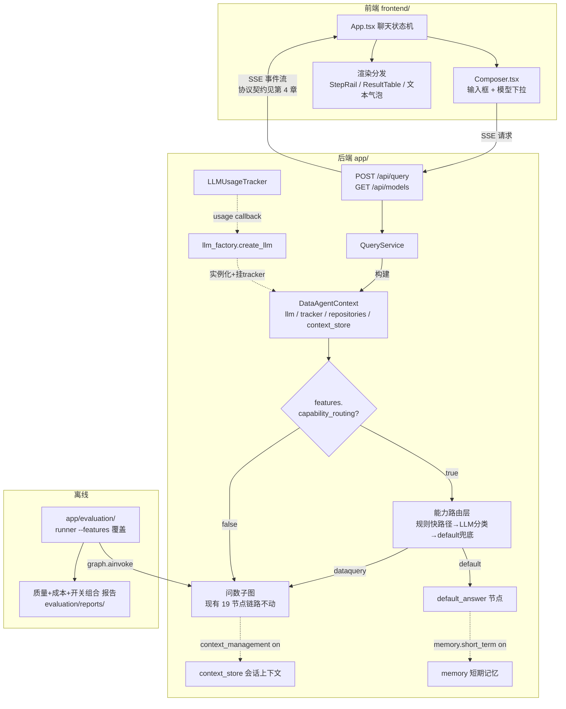

# 00 · 总体架构与全局约定

> 状态：`final`（已评审定稿）　|　修订记录：2026-09-19 初稿；同日修订模型配置与能力命名（text2sql→dataquery）；2026-09-21 修订定价结构（**3 个物理模型**，DeepSeek 峰谷为计费时段）、M5 拆分为上下文管理（05）/记忆管理（06）两模块、记忆策略定为 Simple Notes + Advanced JSON Cards + 基础回忆评估、路由策略定为规则→embedding→LLM 递进通道、新增评估子模块开关（`features.evaluation.*`）与 M4 的 skill+工具化预留方向
> 本文档是后续所有模块约束文档（01~06）的上位文档，定义全局架构、事件协议契约、Feature Flags 与配置总览。与下位文档冲突时，以本文档为准；本文档修订须同步评审受影响的下位文档。

---

## 1. 目标与边界

### 1.1 演进目标

将现有"电商问数智能体"（单一问数能力的 LangGraph 应用）演进为：

- **能力可扩展**的通用 Agent 架构（能力注册表 + 路由层，v1 只有 dataquery / default 两个能力）
- **模块可开关**的实验平台（Feature Flags 与评估框架联动，量化每个模块的独立贡献）
- **质量与成本双维度可评测**（检索 / SQL / 意图 + token / 费用 / 延迟）

### 1.2 本轮交付边界

- **本轮只产出设计文档**（`docs/design/00~06`），评审定稿后才进入编码
- 明确不做的事：
  - 不新增第三个能力（图表/下钻等仅在扩展预案中占位）
  - 不落地长期记忆的具体存储实现（仅接口与 schema）
  - 不做前端整体通用化改造（预留方向，待能力路由落地后另立计划）
  - 不更换 embedding 模型、不动 Qdrant 512 维约定

### 1.3 模块清单（六大模块）

| # | 模块 | 职责 | 约束文档 |
|---|------|------|---------|
| M1 | LLM 多模型封装 | providers 配置化、create_llm 工厂、用量自动采集 | 01 |
| M2 | 模型选择 | 后端 model 字段 + /api/models；前端模型下拉 | 02 |
| M3 | 评估框架 | 评测集 + 质量指标 + 成本指标 + runner + 报告 + CLI | 03 |
| M4 | 能力路由体系 | 能力注册表 + 三级路由 + graph 改造 + default 能力；**预留演进方向：能力 skill+工具化**（问数从"路由目标"演进为"agent 主动调用的工具"，评估需量化工具触发正确性——04 文档设计） | 04 |
| M5 | 上下文管理 | 轨迹的存储与生命周期：context_store / history_provider / 窗口截断 / 能力间隔离 / KV cache 友好提示词结构 / checkpointer 抽象 | 05 |
| M6 | 记忆管理 | 轨迹之上的使用策略：短期记忆（相关历史检索注入）+ 长期记忆接口预留 | 06 |
| M7 | Feature Flags | 所有模块的配置开关，与 M3 联动做组合实验 | 00（本文档） |

另有贯穿性工作：教学遗留清理与端到端验收（06 文档）。

### 1.4 关键术语约定

| 术语 | 定义 | 使用范围 |
|------|------|---------|
| **轨迹（Trajectory）** | **短期记忆的项目内命名**——单次会话（thread_id）的完整对话记录，包含用户消息、最终回答及关键中间产物 | 05/06 文档及代码命名（如 `trajectory` 相关类/字段） |
| 会话隔离 | 每个 thread_id 独立配备一条轨迹，会话之间记忆与上下文互不可见 | 05 文档（context_store 主键设计）、06 文档（记忆检索范围） |
| 能力（Capability） | 路由层的分发单元，v1 = `dataquery` / `default` | 04 文档及全链路 |
| Provider | LLM 配置条目（模型 + 定价策略）；物理模型共 3 个，DeepSeek 的 peak/offpeak 是 `pricing.tiers` 计费档位（按调用时间自动判定），**不是可选模型** | 01/03 文档 |

> 短期记忆 = 轨迹这一命名由项目所有者指定，避免与通用"session history"概念混淆；接口与字段命名必须遵循（如 `TrajectoryStore` 而非 `ShortTermMemoryStore`）。
> **职责分界**：05（上下文管理）负责轨迹的**存储与生命周期**（记账、截断、隔离、KV cache 结构）；06（记忆管理）负责轨迹之上的**使用策略**（相关历史检索注入）与长期记忆接口。

---

## 2. 系统架构全景

### 2.1 目标态架构图



### 2.2 分层职责（保持现状不变的部分）

| 层 | 现有职责 | 本轮是否改动 |
|----|---------|------------|
| `app/api/` | 路由、依赖注入、lifespan | 改（+model 字段、+GET /api/models） |
| `app/services/` | QueryService 组装 state/context、SSE 封装 | 改（context 注入 llm/tracker） |
| `app/agent/graph.py` | 19 节点编排 | 改（外层加能力路由；问数链路内部不动） |
| `app/agent/nodes/` | 各节点逻辑 | 改（llm 取用方式；simple_answer 收编） |
| `app/clients/` / `app/repositories/` / `app/models/` / `app/entities/` | 基础设施与数据访问 | **不动** |
| `frontend/src/` | 聊天 UI + SSE 解析 | 改（模型下拉；协议类型同步） |
| `app/evaluation/` | （新建）评估框架，只读 state 与 tracker | 新建，不侵入主链路 |

---

## 3. Feature Flags 定义表（全局唯一权威来源）

所有模块开关集中定义于 `conf/app_config.yaml` 的 `features:` 段。**每行开关的"关闭"语义 = 改造前的旧行为**，保证一键回退 baseline。

### 3.1 开关定义

| 开关 | 类型 | 默认值 | 开启语义 | 关闭语义（=旧行为） | 归属模块 | 约束文档 |
|------|------|--------|---------|-------------------|---------|---------|
| `features.usage_tracking` | bool | `true` | create_llm 给模型实例挂 LLMUsageTracker，自动采集 token/耗时/调用次数 | 不挂 tracker，LLM 调用照常，无任何计量 | M1 | 01 |
| `features.capability_routing` | bool | `true` | 请求进入能力路由层（分类→分发），default 能力可用 | 绕过路由，请求直接进入 dataquery 问数链路（现状行为） | M4 | 04 |
| `features.rules_fast_path` | bool | `true` | 分类前置规则通道生效，**高确定性**正则命中直接分发（0 token） | 关闭规则通道，未命中直接进入下一级（embedding/LLM） | M4 | 04 |
| `features.capability_chip` | bool | `true` | 前端能力芯片可用（/api/capabilities 返回 selectable 能力；请求 capability 字段生效，tier-0 分发） | 芯片不渲染、请求 capability 字段被忽略——恒走自动识别（旧行为） | M4 | 02/04 |
| `features.embedding_route` | bool | `true` | 规则未命中后启用 embedding 安全网（examples 向量相似度 ≥ 阈值即分发） | 跳过安全网，未命中直接走 LLM 分类 | M4 | 04 |
| `features.context_management` | bool | `true` | 节点历史从 context_store/history_provider 统一供给，含截断与摘要钩子 | 各节点维持现状自行拼 `state["messages"]` | M5 | 05 |
| `features.memory.short_term` | bool | `true` | **v1 无独立行为**：原"会话内检索注入"设计已被 05 轨迹完整注入吸收 | 同左 | M5 | 05 |
| `features.memory.long_term` | bool | `false` | 长期记忆生效：运行后提取（Simple Notes / Advanced JSON Cards）+ 检索注入 + 基础回忆评估（有副作用：持久化写入） | 不提取、不注入、评测跳过 memory 用例 | M6 | 06 |
| `features.evaluation.retrieval_metrics` | bool | `true` | 计算检索三通道指标（hit@k/MRR/P/R） | 报告中该区标记 `disabled`，不计算 | M3 | 03 |
| `features.evaluation.intent_metrics` | bool | `true` | 计算意图准确率与混淆矩阵 | 同上 | M3 | 03 |
| `features.evaluation.sql_metrics` | bool | `true` | 计算 SQL 可执行率与结果集正确性 | 同上 | M3 | 03 |
| `features.evaluation.cost_metrics` | bool | `true` | 计算 token/费用/环节耗时成本指标 | 同上（token 计数仍采集，仅不折算呈现） | M3 | 03 |
| `features.evaluation.tool_metrics` | bool | `true` | 计算工具/能力触发正确性（v1=能力路由命中；skill 化后=真实 tool_calls） | 同上 | M3 | 03 |
| `features.evaluation.memory_metrics` | bool | `true` | 计算基础回忆三指标（存储成功率/回忆准确率/跨实例存活） | 报告 memory 区标记 `disabled` | M3 | 06 |

### 3.2 开关使用纪律

1. **关闭 = 旧行为**：任何开关关闭后，系统行为必须与改造前完全一致（这是评估对照组有效性的前提）
2. **开关只在模块边界生效**：只允许在注入层（QueryService/dependencies）、路由层（graph 入口）、采集层（llm_factory）判断；**禁止**散落到节点内部逻辑
3. **"开/关"是同一条链路的两个配置态，不是两套代码**
4. **评估联动**：`app/scripts/run_evaluation.py` 支持 `--features key=value` 运行时覆盖（构造 override 配置注入，不修改配置文件），同一数据集跑多组开关组合 → 报告并排对比
5. **评估模块本身没有开关**：它不在在线链路上，评测由 CLI 显式发起，天然隔离

---

## 4. 前后端事件协议契约 ⭐

> 本章是前后端的共同宪法。后端定义事件的数据结构；前端决定展示形式。`frontend/src/types/agent.ts` 中 `AgentEvent` 联合类型是本契约的 TypeScript 镜像，两边改动必须同步评审。

### 4.1 传输层

- 请求：`POST /api/query`，`Content-Type: application/json`，`Accept: text/event-stream`
  - 请求体（现状）：`{"query": string, "thread_id": string}`
  - 请求体（编码阶段扩展）：增加 `"model": string`（见 02 文档）
- 响应：`Content-Type: text/event-stream`，长连接流式输出
- **帧格式**：每条事件一个 SSE 帧——`data: ` 前缀 + JSON 文本 + 空行结尾：

```
data: {"type": "progress", "step": "执行SQL", "status": "running"}\n\n
```

- 序列化规则（后端）：`json.dumps(payload, ensure_ascii=False, default=str)`——中文不转义；日期等非 JSON 原生类型以 `str()` 兜底
- 解析规则（前端）：按 `\n\n` 切帧 → 取 `data:` 行 → `JSON.parse`；**解析失败时不得中断连接**，降级为一条本地 `error` 事件（现状 `parseSseChunk` 已如此实现，保持）

### 4.2 事件类型全集（现状 v0）

| type | 用途 | 字段 | 产出方 |
|------|------|------|--------|
| `progress` | 步骤执行进度 | `step: string`（中文步骤名，如"理解用户意图"/"执行SQL"）、`status: "running" \| "success" \| "error"` | 各节点 `runtime.stream_writer` |
| `result` | 查询结果数据 | `data: unknown`（run_sql 的执行结果，结构化行列数据） | run_sql 节点 |
| `explanation` | 结果的自然语言解释 | `text: string` | explain_result 节点 |
| `error` | 错误（流程失败或未捕获异常） | `message: string` | fail 节点 / QueryService 异常兜底 |

示例帧：

```json
data: {"type": "progress", "step": "理解用户意图", "status": "running"}

data: {"type": "progress", "step": "理解用户意图", "status": "success"}

data: {"type": "result", "data": {"columns": ["region", "gmv"], "rows": [["华北", 123456.78]]}}

data: {"type": "explanation", "text": "华北地区 GMV 为 12.35 万元。"}

data: {"type": "error", "message": "SQL 执行超时"}
```

> 注：`result.data` 的内部结构目前由仓储层返回值决定（`unknown`），编码阶段在 03/04 文档中收敛为明确的行列结构定义。

### 4.3 `capability` 字段引入规则（v1，随 M4 落地）

- **时机**：编码阶段第 14 步（intent-routing）落地；落地前所有事件无此字段，前端不依赖它
- **规则**：
  1. 路由层判定能力后，**该请求产生的所有后续事件**统一附加 `"capability": "<能力名>"`（v1 取值：`dataquery` | `default`）
  2. `capability_routing` 开关关闭时（直接进 dataquery），事件附加 `"capability": "dataquery"`，保证字段恒在
  3. `capability` 是**附加字段而非新事件类型**，旧前端忽略该字段不受影响
- **前端分发升级**：`AgentEvent` 各成员加可选 `capability?: string`；渲染层从"仅按 type 分发"升级为"按 `capability × type` 二维分发"（type 为主键，capability 决定特定渲染器，如未来图表能力的结果渲染）

### 4.4 向后兼容规则（硬约束）

1. **允许**：新增事件字段（前端必须忽略未知字段）、新增事件类型、新增步骤名（`step` 是开放枚举，前端按字符串聚合步骤条）
2. **禁止**：修改已有字段的语义或类型、删除已有字段、修改已发布事件类型的 `type` 取值
3. **未知事件类型的兜底**：前端收到未识别的 `type` 时，必须兜底渲染为文本气泡（或静默忽略），**不得崩溃、不得中断流**
4. **破坏性变更流程**：确需破坏性变更时，先在 00 文档登记协议版本（预留 `protocol_version` 字段机制），前后端同步评审后实施
5. **步骤名（step）约定**：中文文案允许调整，但同一节点内 running/success/error 三次推送必须使用相同字符串（前端按 step 聚合状态）

### 4.5 职责边界声明

| 决策 | 归属 | 说明 |
|------|------|------|
| 事件类型、字段结构、序列化格式 | **后端** | 本文第 4 章即契约；后端实现于 `query_service.py` 与各节点 writer |
| 数据如何展示（表格/文本/图表） | **前端** | 按事件 type（未来按 capability×type）分发渲染器 |
| 协议变更的评审 | 双方 | 任何契约改动须更新 00 文档并同步 `types/agent.ts` |

---

## 5. 配置文件结构总览

### 5.1 `conf/app_config.yaml` 最终形态

```yaml
logging:                      # [不变]
  file: {enable: true, level: INFO, path: logs, rotation: "10 MB", retention: "7 days"}
  console: {enable: true, level: INFO}

db_meta:                      # [不变] 元数据库（MySQL 3307）
  host: localhost
  port: 3307
  user: lzs
  password: Lzs666
  database: meta

db_dw:                        # [不变] 数仓库（MySQL 3307）
  host: localhost
  port: 3307
  user: lzs
  password: Lzs666
  database: dw

qdrant:                       # [不变] embedding_size=512 与 bge-small-zh 耦合，禁止单独改动
  host: localhost
  port: 6333
  embedding_size: 512

embedding:                    # [不变]
  host: localhost
  port: 8081
  model: BAAI/bge-small-zh-v1.5

es:                           # [MODIFY] 删除无效的 index_name（实际索引由 ValueESRepository 硬编码 value_index，04 阶段顺手改为配置注入）
  host: localhost
  port: 9200

llm:                          # [MODIFY] 单模型 → 多厂商 providers（详见 01 文档）
  default: deepseek           # 默认 provider；请求未指定/非法时兜底
  providers:
    # 物理模型共 3 个。DeepSeek 的峰谷是"计费时段"而非模型版本或用户选项——
    # 由调用发生时的真实时间（北京时间）自动判定 tier，前端下拉只展示 3 个模型。
    deepseek:
      base_url: https://api.deepseek.com      # OpenAI 格式（Anthropic 格式端点本项目不使用）
      api_key: ${DEEPSEEK_API_KEY}
      model: deepseek-flash                   # 版本 DeepSeek-V4.1-Flash；思考模式默认开启（关闭方式在 01 文档定义）
      pricing:
        tiers:
          peak:                               # 高峰：周一至周五 9:00–12:00、14:00–18:00（北京时间）
            input: 2.0                        # 输入·缓存未命中
            input_cache_hit: 0.04             # 输入·缓存命中
            output: 8.0
          offpeak:                            # 空闲：工作日 12:00–14:00、18:00–次日9:00、周末全天、法定节假日全天
            input: 1.0
            input_cache_hit: 0.02
            output: 4.0
        tier_rules: beijing_workweek          # 时段判定器标识（实现见 03 文档 cost 模块）
    qwen:
      base_url: https://dashscope.aliyuncs.com/compatible-mode/v1
      api_key: ${DASHSCOPE_API_KEY}
      model: qwen3.8-flash
      pricing:
        tiers:
          standard:                           # 无分时段策略 → 单一 standard 档
            input: 0.8
            input_cache_hit: 0.1
            output: 2.7
          # Batch/显式缓存等促销价不纳入 v1 成本核算
    glm:
      base_url: https://open.bigmodel.cn/api/paas/v4
      api_key: ${ZHIPU_API_KEY}
      model: glm-5.3-flash
      pricing:
        tiers:
          standard:
            input: 0.8
            input_cache_hit: 0.23
            output: 2.8
          # Batch 限时5折价（1.35）等促销价不纳入 v1 成本核算

# pricing.tiers.* 单位均为元/百万 token；档位缺失（null）时成本指标降级为仅 token 计数。
# 定价表外置于配置，厂商调价只需改此文件。
# DeepSeek 峰谷归属由 03 文档的时段判定器按调用时间戳自动计算（评测时可 --pricing-tier 强制固定以便对比）。

sql:                          # [不变]
  max_retries: 2

features:                     # [NEW] 模块开关，定义见第 3 章
  usage_tracking: true
  capability_routing: true
  rules_fast_path: true
  context_management: true
  memory:
    short_term: true
    long_term: false          # 预留，默认关闭
```

- 环境变量替换机制不变（`app/conf/app_config.py` 正则替换 `${VAR}`，缺失时保留原样）
- `AppConfig` dataclass 同步调整：`LLMConfig` 拆分为 `LLMProvidersConfig`（含 `default` 与 `providers: dict[str, LLMProviderConfig]`），新增 `FeatureFlags`——字段定义在 01 文档给出

### 5.2 `conf/capability_config.yaml` 最终形态（新建）

```yaml
# 能力注册表：新增能力的接入成本 = 此文件加一个条目 + 实现一个统一签名的处理节点
capabilities:
  - name: dataquery                   # 电商问数（现有 19 节点链路；原计划名 text2sql 已更名为 dataquery）
    description: 基于电商数仓的指标查询与SQL问答
    examples: ["上个月GMV多少", "华北地区的复购率"]
    entry: extract_keywords           # 图中入口节点名（路由命中后分发到该节点）
    selectable: true                  # 前端能力芯片可见（tier-0 显式选择）
    rules:                            # 规则快路径：只放"高度确定"表述，模糊词交由 embedding/LLM 层
      - "数据查询|查询数据|查一下数据"
      - "(帮我|给我)?(统计|查询|查一下).{0,12}(GMV|销售额|订单量|复购率|客单价|转化率|销量)"
  - name: default                     # 默认通用对话（兜底）
    description: 通用助手对话：闲聊、使用帮助、回顾上次结果、无法归类问题的兜底
    examples: ["你好", "你能做什么", "刚才的结果是什么意思"]
    entry: default_answer
    selectable: false                 # 兜底能力不出芯片（不选芯片 = 自动识别含 default 兜底）
    rules:
      - "^(你好|hi|hello|在吗)"

routing:
  default_capability: default         # LLM 分类成功但结果不在注册表时兜底
  error_capability: default           # LLM 调用失败时兜底（通用对话节点致歉并建议重试）
  classifier_provider: deepseek       # 路由分类专用 LLM（暂定；后续按评估的精准度+速度敲定）
  embedding_threshold: 0.85           # embedding 安全网命中阈值
  # 识别通道：规则(高确定性) → embedding 安全网 → LLM 分类的四级递进，详见 04 文档 §3.2
```

> 完整 Schema、能力接口约定与开关组合行为矩阵见 04 文档。

---

## 6. 模块间依赖关系

### 6.1 文档依赖（写作顺序）

```
00_overview ──┬─→ 01_llm_factory ─→ 02_model_selection
              │         └─────────→ 03_evaluation
              ├─→ 04_capability_routing ─→ 05_context_management ─→ 06_memory
              └──────────────（2/3/4/5/6 全部）──→ 07_acceptance
```

### 6.2 运行时依赖（编码顺序）

```
M1 LLM封装(01) ─→ M2 模型选择(02) ─→ M3 评估(03, 跑baseline)
                        │
                        └─→ M4 能力路由(04) ─→ M5 上下文/记忆(05) ─→ 验收(06)
```

关键依赖说明：

- M3 依赖 M1：评测用例的 LLM 调用走同一 llm_factory，用量采集是成本指标的数据来源
- M3 在 M4 之前：先对现有体系跑 baseline，M4/M5 完成后重跑对比
- M5 依赖 M4：先有多能力格局，上下文隔离与记忆注入才有真实调度场景
- M1 编码时同步收拢 messages 读写入口，为 M5 接管铺路

---

## 7. 文档索引与评审流程

### 7.1 文档索引

| 文档 | 模块 | 状态 |
|------|------|------|
| 00_overview.md（本文） | 总体架构 + 协议契约 + Flags + 配置总览 | final（2026-09-21 修订） |
| 01_llm_factory.md | M1 | final（2026-09-21 修订定价结构） |
| 02_model_selection.md | M2 | final（2026-09-21 修订上拉弹层/3 模型） |
| 03_evaluation.md | M3 | final（2026-09-21 补工具指标/子模块开关） |
| 04_capability_routing.md | M4 | final（2026-09-21 路由策略经所有者确认） |
| 05_context_management.md | M5 上下文管理 | 待撰写（拆分自原 05） |
| 06_memory.md | M6 记忆管理 | 待撰写（拆分自原 05） |
| 07_acceptance.md | 验收 | draft（待评审） |

### 7.2 评审流程约定

1. 每份文档完成即提交评审，**用户确认后标记 `final`**，再写下一份
2. 评审意见的处理规则：文字性意见直接修订；结构性意见（改接口/改配置结构/改协议）修订后需用户复核该章节
3. 全部文档定稿后输出"编码就绪"结论，进入编码阶段
4. **编码阶段发现文档缺陷**：先修订对应文档（回评审）再继续编码，文档与代码始终一致
5. 每份文档头部维护状态标记（draft / final）与修订记录

### 7.3 下位文档的固定章节模板

每份 01~06 文档统一包含六章：

1. 目标与边界（做什么/不做什么/依赖模块）
2. 配置 Schema（涉及 YAML 的完整最终形态，含注释）
3. 接口与数据结构（函数签名/类定义/dataclass/state 字段，代码块精确给出）
4. 对现有代码的改动点清单（精确到文件+函数，标注 [NEW]/[MODIFY]/[DELETE]）
5. Feature Flags 开关语义（本模块受哪些开关控制，开/关行为）
6. 验收标准（可验证条目）

---

## 8. 全局实施红线（所有文档与编码必须遵守）

1. 本轮**只写文档不动代码**；所有 [NEW]/[MODIFY] 仅存在于文档改动点清单
2. Feature Flags：**关闭 = 旧行为**；开关只在模块边界生效
3. 问数子图 19 节点**内部逻辑不动**，只改 llm 取用方式与历史供给入口
4. 评估框架**只读**最终 state 与 tracker 明细，不侵入主链路
5. 事件协议变更遵守 4.4 节向后兼容规则
6. Qdrant 512 维与 bge-small-zh 的耦合关系不得单独破坏（换模型须另立计划）
7. Windows 环境：文件路径一律 pathlib；MySQL 端口 3307（本机 3306 被占用）
8. 依赖最小化：后端仅新增 `langchain-openai`；不引入 ragas/langfuse 等重框架
9. **KV cache 友好性是 05 文档的硬性设计约束**：现状各节点独立拼 prompt（`chain = prompt | llm | parser`）导致请求前缀不稳定，无法命中厂商隐式前缀缓存（DeepSeek 缓存命中价 0.02/0.04 元 vs 未命中 1~2 元，差距 50 倍）。05 的上下文管理策略必须包含"稳定前缀 + 追加式历史"的提示词结构改造；01/04 阶段**禁止**顺手"优化"提示词结构（避免与对照实验冲突），改造统一在 05 实施并以缓存命中成本入报告验证
10. **会话隔离**：一切会话级数据（轨迹、checkpointer 状态）以 thread_id 为主键严格隔离，跨会话不可访问
